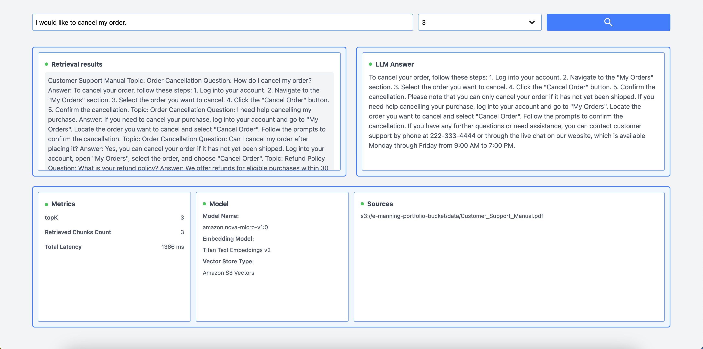

# AWS x RAG (Retrieval-Augmented Generation)

RAG application using Amazon Bedrock Knowledge Bases to retrieve relevant context and generate LLM responses.



### 🧠 How It Works

#### ▫️ Indexing / Ingestion phase

1. Manual document ingestion to S3
2. Text chunking
3. Each chunk is converted into a numerical vector by embedding model on Bedrock Knowledge Base
4. Generated embeddings are indexed to enable search
5. Vectors are stored in S3 Vectors

#### ▫️ Retrieval / Generation phase

1. User query
2. Query is converted into a vector by embedding model on Bedrock Knowledge Base
3. Starts vector similarity search
4. Retrieved document chunks are used for LLM

### 🏗 Architecture

<p>
  
  <br />
  <sub>Architecture diagram created with Lucidchart</sub>
</p>

### 🚀 Features

- RAG retrieval
- topK control
- Semantic search

### 🛠 Tech Stack

#### ▫️ Frontend

- React (Vite)
- Tailwind

#### ▫️ Backend / AWS

- Amazon Bedrock
- Amazon Bedrock Knowledge Base
- AWS Lambda
- Amazon API Gateway
- Amazon S3 Vectors

### 📦 Installation

Clone the repository and install dependencies.

```bash
git clone https://github.com/eobcre/bedrock-rag-project.git
cd bedrock-rag-project
npm install
```

**Environment Variables**

```
KNOWLEDGE_BASE_ID=your_knowledge_base_id
MODEL_ID=your_model_id
```

**Run Locally**

```
npm run dev
```

Note: This application requires a deployed AWS backend. (API Gateway, Lambda and Bedrock)
